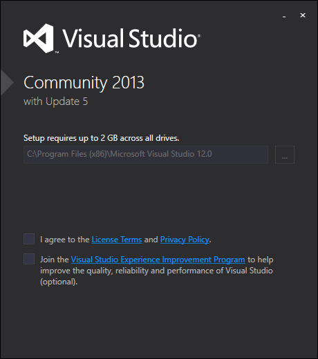
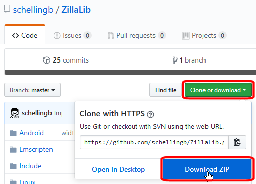
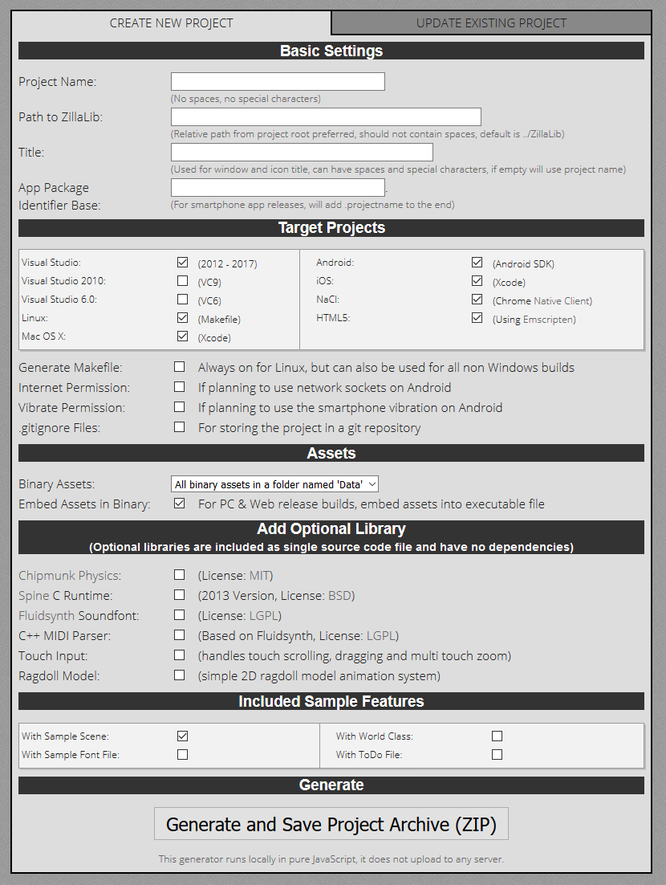
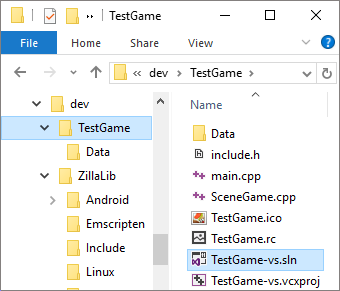
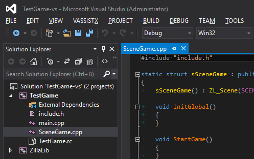

The recommended way of writing code, testing and debugging is on a Windows PC with Visual Studio.

This tutorial explains in a few steps how to go from zero to your first project in just a few steps.

1. 
   Get Visual Studio (any version of any edition except Code).

   Get the latest version [from Microsoft](https://www.visualstudio.com/downloads/).

2. 
   Next we get the latest master branch of the [ZillaLib from the github repository](https://github.com/schellingb/ZillaLib), either by
   checking it out via git or subversion, or by downloading the ZIP file.  

   Because the library gets compiled automatically together with the first project build, we don't need to do anything further here.
   Let's get started with an actual game project right away.

3. 
   Open up the ZillaLib project generator which is [available online](/project-generator/) or offline in
   the library under `/Tools/project-generator.html`.

   At the top you enter a project name which decides project and output file names.  
   Next is the path to ZillaLib. It's easiest to place the game project in a subdirectory next to the library and name the directory of the
   library just "ZillaLib", in that case you can leave the input empty because it matches the default. Otherwise you need to enter the relative
   path from the game project to the library. For example if ZillaLib is placed at `C:\dev\lib\zillalib-master` and the game project is at
   `C:\dev\game\testgame` you need to enter `../../lib/zillalib-master`.

   The other options can be left with their default settings. Under Target project at least Visual Studio needs to be selected.

   For now just click `Generate and Save Project Archive (ZIP)` to continue, then extract the project.

4. 
   This is the directory setup we have now with the library and the game project next to each other.

   We can just open the Visual Studio solution file now.

5. 
   As long as the relative directory was set correctly, Visual Studio opens with both the game and the library project.  
   Make sure the configuration is set to `Debug` and the platform is set to `Win32`. Then you can just go ahead and click `DEBUG` -> `Start Without Debugging`.

   This compiles the library and the game in a few seconds and then runs the game.  
   Subsequent builds will be much faster as the library is already built.

6. Make your game!